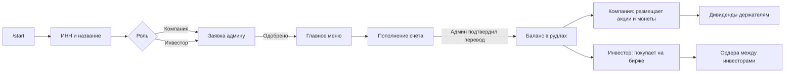

[README.md](https://github.com/user-attachments/files/32771744/README.md)
# BotGreen — учебная онлайн-биржа в Telegram

Telegram-бот, который моделирует работу фондовой биржи. Участники регистрируются как **компании** или **инвесторы**, выпускают акции и собственные криптомонеты, покупают и продают их, выставляют ордера и получают дивиденды. Все расчёты ведутся в игровой валюте — **рудлах**, поэтому проект подходит для экономических игр, кружков и уроков финансовой грамотности.

> Проект учебный: реальные деньги и настоящие ценные бумаги не используются.

## Чему учит платформа

| Понятие | Как это выглядит в боте |
|---|---|
| Размещение акций (IPO) | Компания выставляет на биржу акции по своей цене после одобрения администратором |
| Покупка на бирже | Инвестор покупает акции или монеты по цене размещения |
| Вторичный рынок и ордера | Инвесторы выставляют ордера на покупку и продажу и исполняют чужие ордера |
| Срок действия ордера | Неисполненный ордер снимается через 24 часа, акции возвращаются владельцу |
| Дивиденды | Компания выплачивает фиксированную сумму каждому держателю своих акций |
| Выпуск токенов | Компания выпускает собственную криптомонету за листинговый сбор |
| Регулятор | Администратор проверяет регистрации, пополнения и размещения |

## Возможности

### Компания
- Профиль компании: название, ИНН, баланс
- Пополнение счёта
- Размещение акций на бирже: количество и цена за штуку
- Выпуск криптовалюты: название, количество и цена монеты; сбор за размещение — 10 000 рудлов
- Просмотр количества акций на бирже
- Выплата дивидендов держателям акций
- Просмотр биржи (компании не могут покупать акции)

### Инвестор
- Профиль инвестора и баланс
- Пополнение счёта
- Покупка акций и криптовалюты на бирже
- Портфель: «Мои акции» и «Моя криптовалюта»
- Ордера на продажу своих акций и на покупку акций компаний
- Лента всех ордеров с возможностью исполнить чужой ордер
- «Мои ордера» с возможностью удалить свой ордер

### Администратор
Получает заявки в личные сообщения и одобряет или отклоняет:
- регистрацию компаний и инвесторов;
- пополнение счёта;
- размещение акций и криптовалюты;
- выплату дивидендов.

## Как это работает



1. Пользователь отправляет `/start`, вводит ИНН (4 символа) и название компании или ИП.
2. Выбирает роль. Заявка уходит администратору, после одобрения открывается меню.
3. Для пополнения пользователь указывает сумму и переводит рудлы на ИНН биржи в основной игре. Администратор подтверждает перевод, и баланс зачисляется в боте.
4. Дальше участники торгуют: компании размещают бумаги, инвесторы покупают их и перепродают друг другу через ордера.

## Стек

- Python 3.13
- [aiogram 3](https://docs.aiogram.dev/) — Telegram Bot API, FSM для пошаговых диалогов
- SQLAlchemy 2 + SQLite — хранение данных
- asyncio — таймеры истечения ордеров

## Структура проекта

```
botgreen/
├── main.py            # бот: обработчики команд и кнопок, FSM, логика биржи
├── models.py          # модели SQLAlchemy и функции чтения из БД
├── markup.py          # inline-клавиатуры меню
├── requirements.txt   # зависимости
└── use.db             # база SQLite (создаётся автоматически)
```

## Установка и запуск

1. Клонируйте репозиторий:
   ```bash
   git clone https://github.com/dmitrijem/botgreenrock.git
   ```
   ```bash
   cd botgreenrock
   ```

2. Создайте виртуальное окружение и установите зависимости:
   ```bash
   python3 -m venv venv
   ```
   ```bash
   source venv/bin/activate
   ```
   ```bash
   pip install -r requirements.txt
   ```

3. Настройте бота в `main.py`:
   - `BOT_TOKEN` — токен бота от [@BotFather](https://t.me/BotFather);
   - `ADMIN` — Telegram ID администратора (узнать можно, например, у [@userinfobot](https://t.me/userinfobot)). ID администратора также прописан напрямую в нескольких вызовах `bot.send_message(...)` — замените его и там;
   - `ИНН биржи: XXXX` в сообщении о пополнении — укажите ИНН биржи в вашей игре.

4. Запустите бота:
   ```bash
   python main.py
   ```
   При первом запуске создаётся база `use.db` со всеми таблицами. Чтобы начать игру с нуля, удалите этот файл.

## База данных

| Таблица | Что хранит |
|---|---|
| `users` | Участники: Telegram ID, роль, ИНН, название, баланс, число акций и монет на бирже |
| `operations` | Журнал операций: пополнения, размещения и их статусы |
| `birge` | Лоты на бирже: акции (`type = "cost"`) и криптовалюта (`type = "crypto"`) |
| `orders` | Ордера инвесторов на покупку и продажу |
| `costs` | Портфели акций инвесторов (JSON-список) |
| `crypto` | Портфели криптовалюты инвесторов (JSON-список) |

## Правила и ограничения

- ИНН — ровно 4 символа.
- В названии компании нельзя использовать цифры: позиции портфеля хранятся в виде строки «название + количество».
- Название монеты — от 3 до 10 символов.
- Для выпуска монеты на балансе должно быть больше 10 000 рудлов.
- Дивиденды начисляются фиксированной суммой на каждого держателя, а не на каждую акцию.
- Состояния диалогов (`MemoryStorage`) и таймеры ордеров хранятся в памяти: после перезапуска бота они сбрасываются.
- Поддерживается один администратор.

## Идеи для развития

- Вынести токен и ID администратора в переменные окружения (`.env`)
- Сохранять состояния FSM и таймеры ордеров между перезапусками
- Добавить историю сделок и график цены
- Начислять дивиденды пропорционально числу акций
- Покрыть логику биржи тестами

## Контакты

По вопросам об игре — dimaemelianov02@gmail.com.
